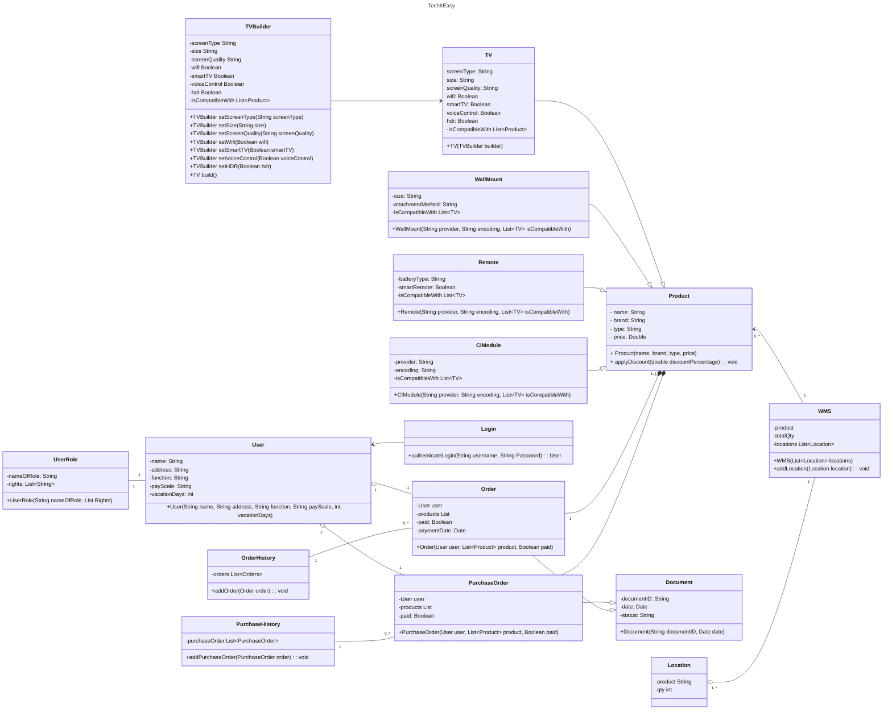

# User Stories
- Als verkoper wil ik een duidelijk overzicht hebben van de actuele voorraad en inkomende goederen, zodat verkoopacties en reclamecampagnes gepland en uitgevoerd kunnen worden.
- Als financieel directeur wil ik de inkoop- en verkoopprijzen en aantallen makkelijk kunnen beheren per product, zodat ik minder tijd kwijt ben aan administratie en meer overzicht heb over de financiële status van het bedrijf.
- Als financieel directeur wil ik duidelijk kunnen zien hoeveel producten er verkocht zijn en wanneer die verkocht zijn, zodat hier een analyse op los gelaten kan worden.
- Als financieel directeur wil ik de aantallen per product en de datum van wanneer ze ingekocht zijn kunnen inzien, zodat ik betere vooruitzichten heb en uiteindelijk betere afspraken kan maken met de leverancier.
- Als magazijnbeheerder wil ik een systeem dat duidelijk aangeeft wat de locatie van een product is, zodat ik snel en efficiënt producten kan vinden.
- Als magazijnbeheerder wil ik dat voorraden makkelijk toegevoegd kunnen worden na controle van leveringen, zodat de voorraad correct blijft en gecorrigeerd kan worden.

## Functionele eisen

### Voorraadbeheer
1. Het systeem moet kunnen tonen hoeveel producten er per soort op voorraad zijn en hoeveel er nog binnenkomen.
2. Het systeem moet kunnen laten zien hoeveel producten er verkocht zijn en wanneer die verkocht zijn.
3. Het systeem moet duidelijk kunnen aangeven waar producten zich bevinden op elk moment.

### Prijsinformatie
4. Het systeem moet kunnen tonen wat de prijzen van inkoop en verkoop zijn, maar ook de aantallen per product en de datum wanneer ze ingekocht zijn.

### Personeelsbeheer
5. Het systeem moet personeelsgegevens kunnen opslaan en weergeven, inclusief naam, adres, functie, loonschaal en vakantiedagen.
6. Het systeem moet onderscheid maken tussen verschillende gebruikersrechten. Eigenaren moeten volledige toegang hebben tot alle functies van de app, terwijl personeelsleden beperkte toegang krijgen en alleen specifieke acties mogen uitvoeren binnen de app.

### Productinformatie
7. Het systeem moet de naam, merk, type, prijs en mogelijkheden van elk product opslaan.
8. Voor tv's moet het systeem extra informatie opslaan, zoals schermtype, formaat, schermkwaliteit, wifi-mogelijkheden, smart tv-functionaliteit, voice control en HDR-compatibiliteit.
9. Voor afstandsbedieningen moet het systeem het batterijtype en of het een smart remote is opslaan.
10. Voor muurbeugels moet het formaat en de bevestigingsmethode worden opgeslagen.
11. Voor CI-modules moet het systeem de provider en de gebruikte encoding opslaan.
12. Het systeem moet tonen welke producten samen gebruikt kunnen worden met andere producten.

## Niet functionele eisen

1. **Gebruikersvriendelijkheid** – Het systeem moet gemakkelijk te navigeren zijn, zodat nieuwe gebruikers ook zonder training er gemakkelijk mee kunnen werken.
2. **Betrouwbaarheid** – De downtime van het systeem moet zo beperkt mogelijk zijn en mag niet meer dan 10 uur per jaar zijn.
3. **Onderhoud** – Het systeem is goed gedocumenteerd en modulair. Wijzigingen moeten eenvoudig doorgevoerd kunnen worden; bugfixes moeten binnen 24 uur kunnen worden geïmplementeerd.
4. **Beveiliging** – Het systeem is goed beveiligd en voldoet aan de nieuwste beveiligingsnormen en protocollen, zoals encryptie van data tijdens opslag en overdracht, en implementatie van 2FA voor het inloggen.
5. **Prestatie** – De prestatie (snelheid afhankelijk van gebruik) zal erg hoog liggen. De responstijd voor elke actie mag niet langer dan 2 seconden zijn. Het systeem moet ten minste 1000 gebruikers tegelijkertijd aankunnen. Als de responstijd niet voldoet, moet er een rapport worden geschreven en moet er overwogen worden extra bandbreedte, geheugen of CPU-kracht toe te voegen aan het systeem.

# class diagram

  
Zie hieronder: het klasse diagram van TechItEasy

