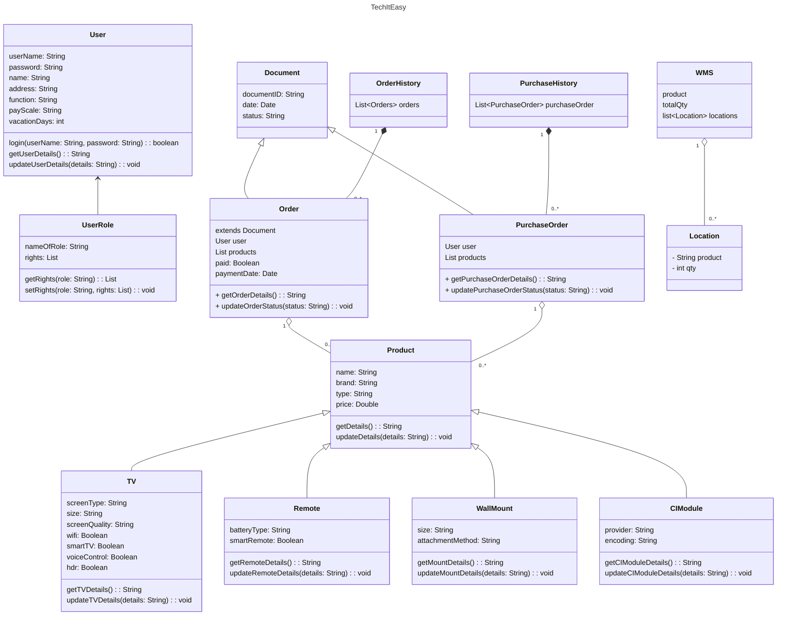

```mermaid
---
title: TechItEasy
---
classDiagram
class Product {
name: String
brand: String
type: String
price: Double
getDetails(): String
updateDetails(details: String): void
}

    class TV {
        screenType: String
        size: String
        screenQuality: String
        wifi: Boolean
        smartTV: Boolean
        voiceControl: Boolean
        hdr: Boolean
        getTVDetails(): String
        updateTVDetails(details: String): void
    }

    class Remote {
        batteryType: String
        smartRemote: Boolean
        getRemoteDetails(): String
        updateRemoteDetails(details: String): void
    }

    class WallMount {
        size: String
        attachmentMethod: String
        getMountDetails(): String
        updateMountDetails(details: String): void
    }

    class CIModule {
        provider: String
        encoding: String
        getCIModuleDetails(): String
        updateCIModuleDetails(details: String): void
    }


    

    class User {
        userName: String
        password: String
        name: String
        address: String
        function: String
        payScale: String
        vacationDays: int
        login(userName: String, password: String): boolean
        getUserDetails(): String
        updateUserDetails(details: String): void
    }

    class UserRole {
        nameOfRole: String
        rights: List<String>
        getRights(role: String): List<String>
        setRights(role: String, rights: List<String>): void
    }

    class Document {
        documentID: String
        date: Date
        status: String
    }

    class Order {
        extends Document
        User user
        List<Product> products
        paid: Boolean
        paymentDate: Date
        + getOrderDetails(): String
        + updateOrderStatus(status: String): void
    }

    class OrderHistory {
    
        List~Orders~ orders
    }

    class PurchaseHistory {
        List~PurchaseOrder~ purchaseOrder

    }


    class PurchaseOrder {
        User user
        List<Product> products
        + getPurchaseOrderDetails(): String
        + updatePurchaseOrderStatus(status: String): void
    }

    class WMS {
        product
        totalQty
        list~Location~ locations
    }

    class Location {
        - String product
        - int qty
    }

Product <|-- TV
Product <|-- Remote
Product <|-- WallMount
Product <|-- CIModule
Document <|-- PurchaseOrder
Document <|-- Order
User <--UserRole
PurchaseHistory "1" *-- "0..*" PurchaseOrder
OrderHistory "1" *-- "0..*" Order

Order "1" o-- "0..*" Product
PurchaseOrder "1" o-- "0..*" Product
WMS "1" o-- "0..*" Location
```