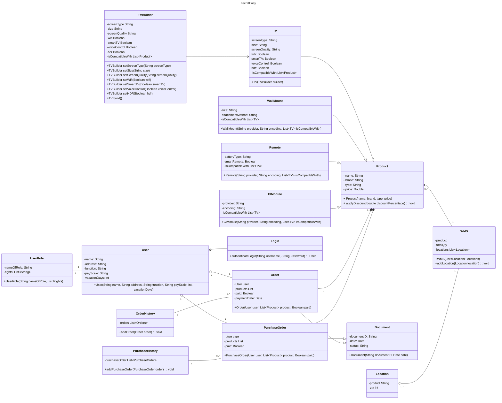

```mermaid
---
title: TechItEasy
---
classDiagram
    direction RL
    class Product {
        - name: String
        - brand: String
        - type: String
        - price: Double
        + Procuct(name, brand, type, price)
        + applyDiscount(double discountPercentage): void
    }

    class TV {
        screenType: String
        size: String
        screenQuality: String
        wifi: Boolean
        smartTV: Boolean
        voiceControl: Boolean
        hdr: Boolean
        -isCompatibleWith List~Product~
        +TV(TVBuilder builder)
    }

    class TVBuilder {
        -screenType String
        -size String
        -screenQuality String
        -wifi Boolean
        -smartTV Boolean
        -voiceControl Boolean
        -hdr Boolean
        -isCompatibleWith List~Product~
        +TVBuilder setScreenType(String screenType)
        +TVBuilder setSize(String size)
        +TVBuilder setScreenQuality(String screenQuality)
        +TVBuilder setWifi(Boolean wifi)
        +TVBuilder setSmartTV(Boolean smartTV)
        +TVBuilder setVoiceControl(Boolean voiceControl)
        +TVBuilder setHDR(Boolean hdr)
        +TV build()
    }
    class Remote {
        -batteryType: String
        -smartRemote: Boolean
        -isCompatibleWith List~TV~
        +Remote(String provider, String encoding, List~TV~ isCompatibleWith)
    }

    class WallMount {
        -size: String
        -attachmentMethod: String
        -isCompatibleWith List~TV~
        +WallMount(String provider, String encoding, List~TV~ isCompatibleWith)
    }

    class CIModule {
        -provider: String
        -encoding: String
        -isCompatibleWith List~TV~
        +CIModule(String provider, String encoding, List~TV~ isCompatibleWith)
    }

    class User {
        -name: String
        -address: String
        -function: String
        -payScale: String
        -vacationDays: int
        +User(String name, String address, String function, String payScale, int, vacationDays)
    }

    class Login {
        +authenticateLogin(String username, String Password): User
    }

    class UserRole {
        -nameOfRole: String
        -rights: List~String~
        +UserRole(String nameOfRole, List<String> Rights)
    }

    class Document {
        -documentID: String
        -date: Date
        -status: String
        +Document(String documentID, Date date)
    }

    class Order {
        -User user
        -products List<Product>
        -paid: Boolean
        -paymentDate: Date
        +Order(User user, List~Product~ product, Boolean paid)
    }
    
    class PurchaseOrder {
        -User user
        -products List<Product>
        -paid: Boolean
        +PurchaseOrder(User user, List~Product~ product, Boolean paid)
    }

    class OrderHistory {
        -orders List~Orders~
        +addOrder(Order order): void
    }
    class PurchaseHistory {
        -purchaseOrder List~PurchaseOrder~
        +addPurchaseOrder(PurchaseOrder order): void
    }

    class WMS {
        -product
        -totalQty
        -locations List~Location~
        +WMS(List~Location~ locations)
        +addLocation(Location location): void
    }

    class Location {
        -product String
        -qty int
    }

    TV <-- TVBuilder
    Product <|-- TV
    Product <|-- WallMount
    Product <|-- Remote
    Product <|-- CIModule
    Document <|-- PurchaseOrder
    Document <|-- Order
    Login --> User
    User "1" -- "1" UserRole
    Order "1" --o "1" User
    PurchaseOrder "1" --o "1" User
    Product "1" *-- "1..*" Order
    Product "1..*" *-- "1" PurchaseOrder
    PurchaseOrder "0..*" -- "1" PurchaseHistory
    Order "0..*" -- "1" OrderHistory
    WMS "1" --> "0..*" Product
    WMS "1" --o "1..*" Location
```